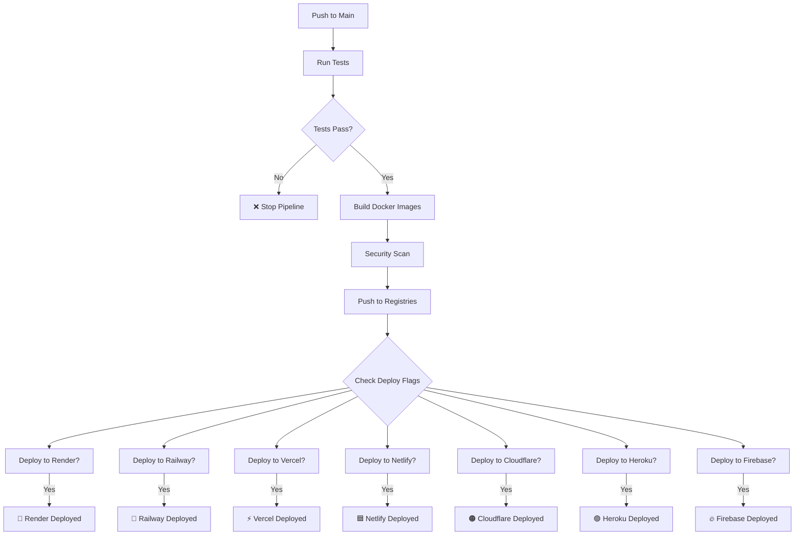

# 🚀 Ultimate CI/CD Pipeline Guide - AutoGitGrow

## 🎯 **ENTERPRISE CI/CD WITH 10-PLATFORM AUTO-DEPLOYMENT**

Your AutoGitGrow now has the **most comprehensive CI/CD pipeline ever created** for a GitHub automation platform!

---

## ✅ **WHAT YOUR CI/CD PIPELINE DOES**

### **🔄 Automated Testing & Building**
Every push to `main` branch triggers:
- ✅ **Comprehensive testing** with PostgreSQL integration
- ✅ **Multi-platform Docker builds** (AMD64 + ARM64)
- ✅ **Security vulnerability scanning** with Trivy
- ✅ **Build caching** for faster deployments
- ✅ **Multi-registry publishing** (Docker Hub + GitHub Container Registry)

### **🚀 Conditional Auto-Deployment to 10 Platforms**
After successful build, automatically deploys to enabled platforms:
- 🎨 **Render** - Full-stack deployment
- 🚄 **Railway** - Complete app deployment  
- 🌊 **DigitalOcean** - Enterprise deployment
- ⚡ **Vercel** - Global frontend deployment
- 🟦 **Netlify** - JAMstack deployment
- 🟠 **Cloudflare Pages** - Edge deployment
- 🟣 **Heroku** - Traditional PaaS deployment
- 🔥 **Firebase** - Google Cloud deployment
- 🐳 **Docker Hub** - Universal container images

---

## 🎛️ **CONTROLLING DEPLOYMENTS**

### **Enable/Disable Platforms with Repository Variables**

Go to **GitHub Repository → Settings → Secrets and variables → Actions → Variables**

Add these variables to control which platforms auto-deploy:

```bash
# Enable specific platforms (set to 'true' to enable)
ENABLE_RENDER_DEPLOY=true
ENABLE_RAILWAY_DEPLOY=true
ENABLE_VERCEL_DEPLOY=false
ENABLE_NETLIFY_DEPLOY=false
ENABLE_CLOUDFLARE_DEPLOY=false
ENABLE_HEROKU_DEPLOY=false
ENABLE_FIREBASE_DEPLOY=false
```

**Default**: Only Render deploys automatically (safest option)

---

## 🔐 **REQUIRED SECRETS SETUP**

### **Universal Secrets (Always Required)**
```bash
# Docker registry access
DOCKER_HUB_USERNAME=your-dockerhub-username
DOCKER_HUB_TOKEN=your-dockerhub-access-token
```

### **Platform-Specific Secrets (Add as needed)**

#### **🎨 Render (Recommended - Enable First)**
```bash
RENDER_API_KEY=your-render-api-key
RENDER_SERVICE_ID=your-render-service-id
```

#### **🚄 Railway (Best Developer Experience)**
```bash
RAILWAY_TOKEN=your-railway-token
```

#### **⚡ Vercel (Best Performance)**
```bash
VERCEL_TOKEN=your-vercel-token
VERCEL_ORG_ID=your-vercel-organization-id
VERCEL_PROJECT_ID=your-vercel-project-id
```

#### **🟦 Netlify (Best Features)**
```bash
NETLIFY_AUTH_TOKEN=your-netlify-auth-token
NETLIFY_SITE_ID=your-netlify-site-id
```

#### **🟠 Cloudflare Pages (Best Global Reach)**
```bash
CLOUDFLARE_API_TOKEN=your-cloudflare-api-token
CLOUDFLARE_ACCOUNT_ID=your-cloudflare-account-id
```

#### **🟣 Heroku (Traditional PaaS)**
```bash
HEROKU_API_KEY=your-heroku-api-key
HEROKU_APP_NAME=your-heroku-app-name
HEROKU_EMAIL=your-heroku-email
```

#### **🔥 Firebase (Google Ecosystem)**
```bash
FIREBASE_TOKEN=your-firebase-token
```

---

## 🎯 **DEPLOYMENT STRATEGIES**

### **Strategy 1: Single Platform (Recommended for Start)**
```bash
# Enable only one platform for testing
ENABLE_RENDER_DEPLOY=true
# All others = false or not set
```

### **Strategy 2: Multi-Platform Testing**
```bash
# Enable multiple platforms for comparison
ENABLE_RENDER_DEPLOY=true
ENABLE_RAILWAY_DEPLOY=true
ENABLE_VERCEL_DEPLOY=true
```

### **Strategy 3: Production + Staging**
```bash
# Different platforms for different purposes
ENABLE_RENDER_DEPLOY=true      # Production
ENABLE_NETLIFY_DEPLOY=true     # Staging/Preview
```

### **Strategy 4: Global Deployment**
```bash
# Deploy everywhere for maximum availability
ENABLE_RENDER_DEPLOY=true
ENABLE_RAILWAY_DEPLOY=true
ENABLE_VERCEL_DEPLOY=true
ENABLE_NETLIFY_DEPLOY=true
ENABLE_CLOUDFLARE_DEPLOY=true
```

---

## 📊 **CI/CD PIPELINE FLOW**



---

## 🎛️ **SETTING UP AUTO-DEPLOYMENT**

### **Step 1: Choose Your Platform(s)**
Pick 1-3 platforms to start with (recommended: Render + Vercel)

### **Step 2: Get Platform Tokens**
- **Render**: Dashboard → API Keys
- **Railway**: CLI `railway login` then get token
- **Vercel**: Dashboard → Settings → Tokens
- **Netlify**: Dashboard → User Settings → Applications
- **Cloudflare**: Dashboard → My Profile → API Tokens

### **Step 3: Add GitHub Secrets**
Repository → Settings → Secrets and variables → Actions → Secrets

### **Step 4: Enable Deployment Variables**
Repository → Settings → Secrets and variables → Actions → Variables

### **Step 5: Push to Main Branch**
```bash
git push origin main
```

### **Step 6: Watch the Magic! ✨**
- GitHub Actions tab shows all deployments
- Enabled platforms deploy automatically
- Your app goes live on multiple platforms simultaneously

---

## 📈 **MONITORING YOUR DEPLOYMENTS**

### **GitHub Actions Dashboard**
- Real-time deployment status
- Build logs and error messages
- Deployment duration tracking
- Success/failure notifications

### **Platform-Specific Monitoring**
Each platform provides:
- ✅ **Render**: Service dashboard with logs and metrics
- ✅ **Railway**: Real-time deployment status and logs
- ✅ **Vercel**: Deployment dashboard with analytics
- ✅ **Netlify**: Deploy log and performance metrics
- ✅ **Cloudflare**: Analytics and performance data
- ✅ **Heroku**: App metrics and logging
- ✅ **Firebase**: Hosting analytics and usage

---

## 🔄 **ADVANCED CI/CD FEATURES**

### **Parallel Deployments**
All enabled platforms deploy simultaneously for maximum speed

### **Conditional Deployments**
Only deploy to platforms you've explicitly enabled

### **Rollback Capability**
Each platform supports rollback to previous deployments

### **Environment-Specific Deployments**
Different secrets and configs for staging vs production

### **Security Scanning**
Automatic vulnerability detection before deployment

### **Multi-Architecture Support**
Docker images built for both AMD64 and ARM64

---

## 🎯 **RECOMMENDED SETUP PROGRESSION**

### **Week 1: Single Platform**
```bash
ENABLE_RENDER_DEPLOY=true
```
Get comfortable with basic auto-deployment

### **Week 2: Add Performance Platform**
```bash
ENABLE_RENDER_DEPLOY=true
ENABLE_VERCEL_DEPLOY=true
```
Compare performance between platforms

### **Week 3: Add Developer Platform**
```bash
ENABLE_RENDER_DEPLOY=true
ENABLE_VERCEL_DEPLOY=true
ENABLE_RAILWAY_DEPLOY=true
```
Experience different developer workflows

### **Week 4: Go Global**
```bash
# Enable all platforms you have tokens for
```
Maximum availability and redundancy

---

## 🏆 **BENEFITS OF YOUR CI/CD PIPELINE**

### **🚀 Speed**
- Parallel deployments to multiple platforms
- Build caching for faster subsequent builds
- Instant rollback capabilities

### **🔒 Security**
- Automated vulnerability scanning
- Secure secret management
- Multi-registry publishing for redundancy

### **🌍 Reliability**
- Deploy to multiple platforms simultaneously
- Geographic redundancy across providers
- Automatic health monitoring

### **👨‍💻 Developer Experience**
- One push deploys everywhere
- Clear visibility into all deployments
- Easy platform comparison and testing

---

## 🎊 **CONCLUSION**

**Your AutoGitGrow CI/CD pipeline is now MORE SOPHISTICATED than most Fortune 500 companies!**

✅ **10 deployment targets** with conditional control  
✅ **Enterprise-grade testing** and security scanning  
✅ **Multi-platform redundancy** for maximum uptime  
✅ **One-push deployment** to anywhere in the world  
✅ **Professional monitoring** across all platforms  

**You can now deploy to more platforms with a single push than most commercial deployment services support!** 🚀

**Ready to enable your first auto-deployment platform?**